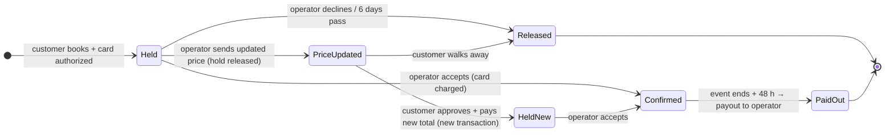

# Operator program — operators list rides, set prices, get paid (founder direction 2026-10-04)

Status: **early access only.** Built: `/operators` landing page (noindex, copy not approved) and an application form whose entries appear at `/internal/operators`. **Not built:** operator accounts, Stripe onboarding, operator listings, the transaction process, SMS. Nothing here changes the managed track (`PROJECT_BRIEF.md`): we keep selling under our own seller account. Operator listings run alongside it later, and are not a launch dependency.

Single source for page numbers: `src/lib/operators/program.ts` (`operatorCommissionPct: 0`, `customerServiceFeePct: null`, `copyApproved: false`).

## 1. The founder's model

1. Operator lists a ride and sets the price.
2. Customer picks a date, enters the event requirements, and pays. The money is already secured when the operator sees the request.
3. Operator gets a text and an email.
4. Operator accepts, or needs more money (distance, hours, site) and sends the customer an updated price to pay, or declines.
5. Operators pay **0%**. The marketplace earns a **small percentage of the total**, which covers card processing and running costs. The rate is set later.

## 2. Verified Sharetribe facts (docs checked 2026-10-04)

| Fact | Source |
|---|---|
| Payments use Stripe Connect **destination charges** (`on_behalf_of`). The money goes to the **operator's** Connect account, and the operator's details show on the customer's card receipt. A listing can't take payment until its operator finishes Stripe onboarding (KYC + bank). | [Payments overview](https://www.sharetribe.com/docs/concepts/payments/payments-overview/) |
| **Calendar booking** flow: the card is **authorized** (held) when the customer requests. The operator has **6 days** to accept. Accept captures the payment; decline or expiry releases the hold, and Stripe charges no fee because nothing was captured. | [Payments overview — provider acceptance](https://www.sharetribe.com/docs/concepts/payments/payments-overview/#provider-acceptance), [How calendar booking transactions work](https://www.sharetribe.com/help/en/articles/9106928-how-calendar-booking-transactions-work) |
| Payout happens when the transaction completes, automatically **48 h after the booking ends**. Funds can typically be held for **~90 days**. | same |
| Bookings further than 90 days out: the **off-session payment** pattern. Save the card and accept now, then charge automatically closer to the event. A charge can fail, so the process needs a fallback. | [Off-session payments](https://www.sharetribe.com/docs/concepts/payments/off-session-payments-in-transaction-process/) |
| **Only one PaymentIntent per transaction.** One transaction cannot charge twice. | [Transaction process actions](https://www.sharetribe.com/docs/references/transaction-process-actions/#actionstripe-create-payment-intent) |
| Extra charges: either (a) a second transaction with its own payment (documented pattern), or (b) a manual charge in the Stripe dashboard. With (b), the money lands in **our** balance and we pay the operator by hand. | [Stored cards FAQ](https://www.sharetribe.com/docs/concepts/payments/using-stored-payment-cards/#frequently-asked-questions-about-storing-payment-cards), [Partial refunds](https://www.sharetribe.com/docs/concepts/payments/payments-overview/#how-to-implement-partial-refunds) |
| Refunds are **full only** by default. | same |
| **Price negotiation** (regular flow): the customer requests a quote, and the operator sends or **updates the offer before the customer pays**. It can't be combined with calendar availability without custom code (there is an example `negotiated-booking` process). Paid orders auto-cancel after **75 days** if not delivered. | [Negotiation process](https://www.sharetribe.com/docs/concepts/transactions/negotiation-process/), [Regular price negotiation](https://www.sharetribe.com/help/en/articles/12800532-how-regular-price-negotiation-transactions-work) |
| **Commission:** provider %, customer % (added on top of the price), and minimum or flat fees. Set in Console → Monetization → Commission. | [Commission rates](https://www.sharetribe.com/help/en/articles/8413880-how-to-set-your-marketplace-commission-rates) |
| **The marketplace pays all Stripe fees** out of its commission: card processing, payouts, and monthly active accounts. At 0%/0% we pay them out of pocket. Sharetribe's US example uses 2.9% + 30¢ processing, $2 per active account per month, and 0.25% + 25¢ per payout. Check our actual Stripe rates. | [Stripe's processing fees](https://www.sharetribe.com/help/en/articles/8803821-stripe-s-processing-fees) |
| Payment methods: **cards only** without code. Apple/Google Pay and some push methods need custom work. PayPal isn't supported. ACH bank debit isn't in the supported list (it doesn't confirm immediately). | [Payment methods](https://www.sharetribe.com/docs/concepts/payments/payment-methods-overview/), [Help: payment methods](https://www.sharetribe.com/help/en/articles/8671710-how-payments-with-stripe-work#h_7e42c568d6) |
| **SMS isn't built in.** Use Twilio via Zapier (Sharetribe has a tutorial) or our own integration. | [Zapier SMS tutorial](https://www.sharetribe.com/help/en/articles/8788994-zapier-tutorial-sms-booking-notifications-via-twilio) |
| **Multiple products in one checkout:** one transaction pays **one provider** and holds stock or availability for **one listing**. A cart is possible but needs significant custom development: one checkout per operator, extra listings as line items, and a child transaction per listing to hold its calendar. Several line items for **one** ride (rental + delivery + extra hours + attendant) are standard. | [Shopping cart series](https://www.sharetribe.com/developer-blog/shopping-cart-introduction/) |

## 3. Recommended flow ("pay to request")

Base: Sharetribe's **calendar booking** process, plus one custom path.

1. **Price at checkout should usually be right.** Use custom line items: the base price per day, delivery at so much per mile past an included radius, and extra hours. These are all calculated server-side from the customer's address and times. This makes updated prices the exception.
2. **Updated price = custom work.** One transaction can hold only one payment. So "send updated price" releases the hold and gives the customer a one-click checkout at the new total, which creates a new transaction. The new price must come from a trusted server-side record of the operator's offer, never from the browser.
3. **After acceptance** (an extra hour on the day, damage): use a second "top-up" transaction. Avoid manual dashboard charges, because that money lands in our account and has to be paid out by hand.
4. **Events more than ~80 days out** (common for carnival rides): authorizations only last 7 days, and Stripe holds funds about 90 days. Pick one:
   - Save the card at booking and charge it automatically about 60 days before the event.
   - Take a deposit now and charge the balance later (two transactions).
5. **Operator deposits:** the stock flow pays out after the event. Operators who need money up front for transport need either a custom early payout (a policy decision) or our own working capital.

The page copy describes this flow. It is only accurate once 1–3 are built and item 4 is decided.

## 4. Fee maths (why "0% for operators" needs a customer fee)

Assumes Sharetribe's example US rates (above). Check the real rates before setting the fee.

| $20,000 booking, operator gets $20,000 | Customer fee 3% | Customer fee 5% |
|---|---|---|
| Customer pays | $20,600 | $21,000 |
| Card processing (2.9% + 30¢ on what the customer pays) | −$597.70 | −$609.30 |
| Payout fee (0.25% + 25¢ on $20,000) | −$50.25 | −$50.25 |
| Active account ($2/month) | −$2 | −$2 |
| **Marketplace keeps** | **≈ −$50 (loss)** | **≈ $338** |

Below about **3.3%**, card bookings lose money. International cards cost more. Refunds after capture don't return Stripe's processing fee.

The "0% / keep 100%" headline is only true if the fee is charged to the **customer**. If the percentage comes out of the operator's payout, the page must change.

## 5. Console changes needed later (not applied, IDs not approved)

- A user type for operators (e.g. `operator`) with Stripe payout setup.
- A listing type for operator listings, separate from `managed-ride-rental`, bound to a calendar-booking process (later a custom process with the updated-price path). Proposed id `operator-ride-rental`. Needs founder approval; ids are permanent.
- Commission: provider 0%, customer = the approved fee. Console commission applies to **every** transaction, including managed bookings. Charging the fee only on operator bookings needs custom pricing code.

## 6. Decisions for the founder

1. Who pays the percentage: the customer (keeps "0% for operators" true) or the operator (headline changes)? Also the rate (at least ~3.3% to cover card costs).
2. Events far out: save the card and charge later, or deposit plus balance?
3. Updated-price path: build it (recommended), or start with decline-and-rebook?
4. Operator requirements before going live: insurance, state inspections, signed terms. Not stated on the page until decided.
5. Cancellation and refund policy for operator bookings.
6. SMS provider (Twilio via Zapier is the quickest).
7. Multi-ride checkout: one operator's rides in one checkout (significant custom work), or one booking per ride at launch?
