# Payment states — what each state means for real money

Status: reference for the founder's payment-policy decision. **Nothing here is implemented beyond demo states.** No real charges, no live payment configuration.

## Founder decisions (2026-10-04)

1. **Pay first.** Nobody, operator or customer, is contacted about a request until it is paid (authorized or captured). This is enforced in code: `OUTREACH_POLICY` in `src/lib/requests/state.ts`. Without payment the service refuses to start sourcing, add or contact operators, record operator quotes or send a customer quote (HTTP 402). The team console shows "Awaiting payment — pay-first policy".
2. **Estimates, not prices.** Every displayed price is an estimate. Estimates are set conservatively high while pricing is finalised with the founder's partner; that is internal and never stated to customers. The operator may change the price for location, event type, travel distance and site conditions, and the customer approves any change. A request is not a booking. Wording comes from `src/lib/pricing/policy.ts` and appears on every page that shows a price or the request button.
3. **No phone-number sign-in for operators.** An operator company is identified by the person who completes its Stripe Connect onboarding (identity, business and bank, KYC by Stripe).

### What "pay the estimate first" means mechanically (verified, Sharetribe docs)
- A card payment at request time is an **authorization (hold)** for the full estimate. It lasts **7 days**, and the operator must answer within **6 days**. Accepting captures it; declining or expiry releases it, and Stripe charges no fee because nothing was captured.
- Capture is **all or nothing**. Line items cannot be changed after the payment exists (`privileged-set-line-items` does not update an existing PaymentIntent), and there is one PaymentIntent per transaction.
- So when the operator's price differs from the estimate:
  - **lower**: release the hold and the customer re-authorizes the lower total (a new transaction, custom "update price" path);
  - **higher**: the same, or a second "top-up" transaction.
- Partial refunds after capture are not supported by default.
- A conservatively high estimate means a large hold on the customer's card. The final price is usually reached by a release and a new hold, not by "charging less later".

### Big-ticket payments ($10,000+)
- Cards work at this size. Stripe's limit per charge is far above it; the practical limits are the customer's credit limit and issuer fraud checks. Expect more declines and 3-D Secure prompts on large charges, and say so on the checkout page.
- **Card fees are about 3%.** Sharetribe's US example uses 2.9% + 30¢, which is roughly $580 on $20,000; the marketplace pays this out of its commission. Check our actual Stripe rates.
- **Sharetribe's built-in checkout takes cards only** (Apple and Google Pay with custom work). ACH bank debit and paper checks are not supported in its Stripe flow, because they don't confirm immediately.
- **For customers who can't pay by card** (schools, cities, companies paying by ACH, wire or check), use the **managed track**. We invoice them from our own Stripe account (Stripe Invoicing supports bank transfer) or take a check at the office, mark the request paid internally, and pay the operator ourselves. This needs a custom offline-payment path in Sharetribe if those bookings are to live there too.

### Operator payouts (verified)
- **Not same day.** Calendar-booking payouts are triggered **2 days after the booking ends** (or when we mark the transaction complete in Console). Stripe then takes **about 5–10 business days** (often less) to reach the operator's bank.
- **Operators can't log in and watch the balance.** Sharetribe uses Stripe *Custom* connected accounts and manual payouts, so operators have no Stripe dashboard and see what our marketplace shows them.
- **Paying operators before the event** is possible with a custom transition that pays out at acceptance, but that moves the risk to us: if the event fails after payout, the customer refund comes out of our balance. This is a policy decision, not a default.
- **How long Stripe can hold funds before payout:** 90 days in most countries; Sharetribe's help centre says up to 2 years for US accounts. Verify with Stripe for our account before relying on long holds.

Facts used (sources in `SHARETRIBE_MAPPING.md`): Sharetribe pays the **provider's** Stripe Connect account with destination charges; we (10000 Solutions LLC) are the provider. Card authorizations last **7 days**. Captured funds sit in the provider's Connect balance and are paid out **only when the transaction process triggers a payout** (Sharetribe uses manual payouts). Stock negotiation auto-cancels/refunds **75 days** after payment if not delivered; Stripe holds funds ~90 days (Help Center says up to 2 years for US accounts — conflicting, **verify with Stripe**). One PaymentIntent per transaction. Default integration supports **full refunds only**.

```mermaid
stateDiagram-v2
    direction LR
    [*] --> RequestOnly: customer submits brief
    RequestOnly --> CardSaved: SetupIntent (consent captured)
    RequestOnly --> Authorized: PaymentIntent confirmed (manual capture)
    CardSaved --> Authorized: off-session auth / charge attempt
    CardSaved --> Captured: off-session charge
    Authorized --> Captured: capture (≤ 7 days)
    Authorized --> AuthExpired: 7 days pass, not captured
    AuthExpired --> RequestOnly: funds released to customer
    Captured --> SupplierCommitted: operator commits in writing
    SupplierCommitted --> Confirmed: confirmBooking (all gates)
    Confirmed --> Delivered: event happens
    Delivered --> PaidOut: payout transition → our bank
    RequestOnly --> SourcingFailed: no operator
    CardSaved --> SourcingFailed
    Authorized --> SourcingFailed: void auth (no fee)
    Captured --> Refunded: sourcing failure / cancellation (full refund; processing fee usually not returned)
    SupplierCommitted --> Refunded: cancellation per approved policy
    Confirmed --> Refunded: cancellation per approved policy
    SourcingFailed --> [*]
    Refunded --> [*]
    PaidOut --> [*]
```

| State | Customer sees | Money actually is | Usable by us to pay a supplier? |
|---|---|---|---|
| Request only | "Request received — not booked" | nowhere | No |
| Card saved | "Payment method saved (no money reserved)" | still the customer's | No |
| Authorized | "Funds authorized (not yet collected)" | reserved on the customer's card ≤ 7 days | **No** — not collected, expires |
| Captured (deposit or full) | "Payment collected" | in **our Stripe Connect balance**, held by the platform | **Not yet** — payout requires a process transition |
| Supplier committed | "Operator committed" | unchanged | unchanged |
| Booking confirmed | "Booking confirmed" | unchanged | unchanged |
| Delivered → payout | — | moving to our bank (typically several business days after the payout transition) | **Yes, after it lands** |
| Sourcing failure | "Unable to source" | auth voided, or full refund if captured | — |
| Authorization expiry | (back to request) | released to the customer | — |
| Refund / cancellation | "Refunded" | returned to the customer; processing fees on a captured charge are generally not returned | — |

**The key point:** under the stock Sharetribe flow, a customer's captured payment does **not** become money we can hand to an operator until the transaction pays out — which in the stock negotiation process happens only after delivery. If operators require deposits before the event, those deposits come from **our working capital**, or the process must be customised with an explicit, policy-approved earlier payout (e.g. a deposit payout after supplier commitment). That is a business and accounting decision, not an implementation detail.

## Events more than 75 days after payment

The stock negotiation process will **auto-cancel and refund** a paid transaction not marked delivered within 75 days. Options (decision required):
1. **Save the card now, charge later** (off-session, closer to the event). Customer commitment = saved card + signed terms; money is not reserved. Off-session charges can fail and need a fallback path.
2. **Custom process with timers relative to the event date**, after confirming with Stripe how long funds can be held for our account type.
3. **Deposit now + balance later as two transactions** — but a deposit transaction is subject to the same timers; it does not solve the long-dated case by itself.

**Never mark an event delivered early to avoid a deadline or trigger a payout.** Delivery is a fact about the event, and early marking would release funds before fulfilment and break the refund path.

## Gates already enforced in the dev store (demo mode)

`confirmBooking` requires: an accepted quote, a committed **verified** supplier with an identified unit, and payment state `payment_captured` (demo). A saved card or an authorization never confirms a booking (tested).
