# Payment states — what each state means for real money

Status: reference for the founder's payment-policy decision. **Nothing here is implemented beyond demo states.** No real charges, no live payment configuration.

Facts used (sources in `SHARETRIBE_MAPPING.md`): Sharetribe pays the **provider's** Stripe Connect account with destination charges; we (10000 Solutions LLC) are the provider. Card authorizations last **7 days**. Captured funds sit in the provider's Connect balance and are paid out **only when the transaction process triggers a payout** (Sharetribe uses manual payouts). Stock negotiation auto-cancels/refunds **75 days** after payment if not delivered; Stripe holds funds ~90 days (Help Center says up to 2 years for US accounts — conflicting, **verify with Stripe**). One PaymentIntent per transaction. Default integration supports **full refunds only**.

```mermaid
stateDiagram-v2
    direction LR
    [*] --> RequestOnly: customer submits brief
    RequestOnly --> CardSaved: SetupIntent (consent captured)
    RequestOnly --> Authorized: PaymentIntent confirmed (manual capture)
    CardSaved --> Authorized: off-session auth / charge attempt
    CardSaved --> Captured: off-session charge
    Authorized --> Captured: capture (≤ 7 days)
    Authorized --> AuthExpired: 7 days pass, not captured
    AuthExpired --> RequestOnly: funds released to customer
    Captured --> SupplierCommitted: operator commits in writing
    SupplierCommitted --> Confirmed: confirmBooking (all gates)
    Confirmed --> Delivered: event happens
    Delivered --> PaidOut: payout transition → our bank
    RequestOnly --> SourcingFailed: no operator
    CardSaved --> SourcingFailed
    Authorized --> SourcingFailed: void auth (no fee)
    Captured --> Refunded: sourcing failure / cancellation (full refund; processing fee usually not returned)
    SupplierCommitted --> Refunded: cancellation per approved policy
    Confirmed --> Refunded: cancellation per approved policy
    SourcingFailed --> [*]
    Refunded --> [*]
    PaidOut --> [*]
```

| State | Customer sees | Money actually is | Usable by us to pay a supplier? |
|---|---|---|---|
| Request only | "Request received — not booked" | nowhere | No |
| Card saved | "Payment method saved (no money reserved)" | still the customer's | No |
| Authorized | "Funds authorized (not yet collected)" | reserved on the customer's card ≤ 7 days | **No** — not collected, expires |
| Captured (deposit or full) | "Payment collected" | in **our Stripe Connect balance**, held by the platform | **Not yet** — payout requires a process transition |
| Supplier committed | "Operator committed" | unchanged | unchanged |
| Booking confirmed | "Booking confirmed" | unchanged | unchanged |
| Delivered → payout | — | moving to our bank (typically several business days after the payout transition) | **Yes, after it lands** |
| Sourcing failure | "Unable to source" | auth voided, or full refund if captured | — |
| Authorization expiry | (back to request) | released to the customer | — |
| Refund / cancellation | "Refunded" | returned to the customer; processing fees on a captured charge are generally not returned | — |

**The key point:** under the stock Sharetribe flow, a customer's captured payment does **not** become money we can hand to an operator until the transaction pays out — which in the stock negotiation process happens only after delivery. If operators require deposits before the event, those deposits come from **our working capital**, or the process must be customised with an explicit, policy-approved earlier payout (e.g. a deposit payout after supplier commitment). That is a business and accounting decision, not an implementation detail.

## Events more than 75 days after payment

The stock negotiation process will **auto-cancel and refund** a paid transaction not marked delivered within 75 days. Options (decision required):
1. **Save the card now, charge later** (off-session, closer to the event). Customer commitment = saved card + signed terms; money is not reserved. Off-session charges can fail and need a fallback path.
2. **Custom process with timers relative to the event date**, after confirming with Stripe how long funds can be held for our account type.
3. **Deposit now + balance later as two transactions** — but a deposit transaction is subject to the same timers; it does not solve the long-dated case by itself.

**Never mark an event delivered early to avoid a deadline or trigger a payout.** Delivery is a fact about the event, and early marking would release funds before fulfilment and break the refund path.

## Gates already enforced in the dev store (demo mode)

`confirmBooking` requires: an accepted quote, a committed **verified** supplier with an identified unit, and payment state `payment_captured` (demo). A saved card or an authorization never confirms a booking (tested).
